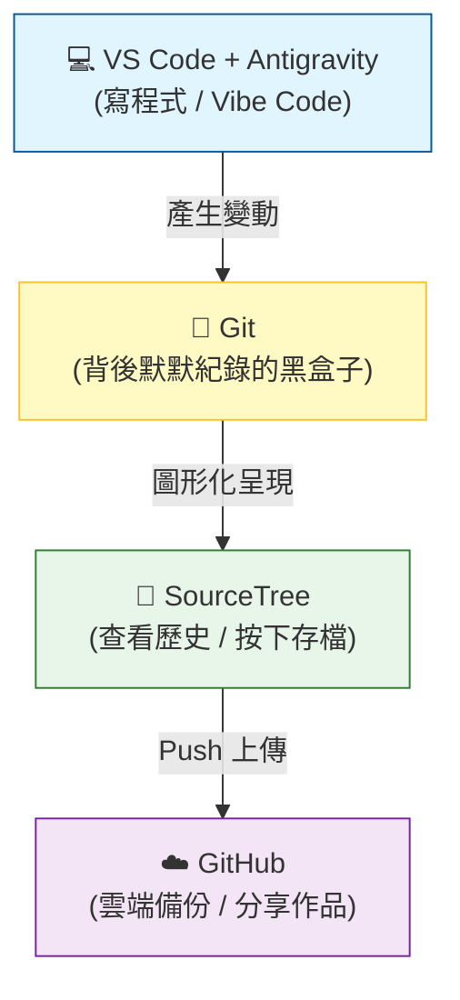

# 🚀 軟體開發入門：從 Vibe Code 到 Git 檔案管理

歡迎來到軟體開發的世界！這份指南是專為**完全不懂軟體、但想開始動手做**的初學者設計的。我們會用最直白的方式，告訴你這些看起來很專業的工具到底是做什麼用的、以及你該怎麼使用它們。

---

## 🏗️ 1. 核心工具大解密：誰是誰？

想像你在蓋一棟房子，你需要不同的工具與場地：

### 🖥️ VS Code + Antigravity (你的 AI 創作中心)
*   **角色**：你的**智慧工作台**。
*   **功能**：這是你寫程式、看成果的地方。**對於初學者來說，你可以將它們視為同一個東西**：VS Code 是你的畫布，而 Antigravity 是幫你拿畫筆的智慧助手。
*   **建議**：初學者只要選擇進入這個「創作環境」即可，不需要分開學習。你可以直接在裡面對著 AI 說出你的想法（這就是所謂的 **Vibe Code**）。
*   **💡 應用場景**：你想做一個「待辦清單」網頁。你只需要在 VS Code 打開一個新檔案，對 Antigravity 說：「幫我用 HTML/CSS 寫一個粉紅色主題的待辦清單」，它就會直接在你面前把程式碼「變」出來。

### 🐙 GitHub
*   **角色**：你的**雲端保險箱與展示櫃**。
*   **功能**：你寫好的東西會傳到這裡備份。別人也可以在這裡看到你的作品，它是全世界程式設計師的社交平台。
*   **💡 應用場景**：如果你電腦不小心噴到咖啡壞掉了，只要你有把程式碼「Push」到 GitHub，換台電腦登入後，所有的程式碼都能一秒找回來。

### 🌳 SourceTree
*   **角色**：你的**地圖與遙控器**。
*   **功能**：Git 本身像是一個隱藏在背景的黑盒子，SourceTree 是把裡面的資料畫成漂亮的「樹狀圖」。你可以清楚看到：「誰在兩天前改了什麼？」，這比輸入一行行的指令（Terminal）要直觀得多。
*   **💡 應用場景**：你昨晚寫得很順，但今天早上 AI 幫你改了一個功能後，整個網頁突然動不了了。你可以打開 SourceTree，找到昨天那個「正確的點」，按一下滑鼠就能讓時間倒流。

---

## 📊 2. 工具差異對照表

| 工具組合 | 類型 | 核心用途 | 什麼時候用它？ |
| :--- | :--- | :--- | :--- |
| **VS Code / Antigravity** | **AI 創作中心** | 撰寫程式、實現想法 | **想做東西時**。直接用說的（Vibe）請 AI 幫你寫出代碼。 |
| **GitHub** | **雲端保險箱** | 備份、分享程式碼 | **想存檔到雲端時**。確保電腦壞了東西還在。 |
| **SourceTree** | **時光機面板** | 視覺化管理檔案版本 | **想看紀錄時**。清楚看到「之前改了什麼」，不小心寫壞了也能一鍵還原。 |

---

## 🧭 3. 開發工具連連看 (資訊流)

這張圖呈現了當你寫程式時，資料是怎麼流動的：

---

## ⚙️ 4. 它們如何協作？（資訊流導覽）

當你今天想做一個新功能，流程通常是這樣的：

1.  **開啟 VS Code**：打開你的專案檔案。
2.  **求助 Antigravity**：跟 AI 說：「幫我做一個航班追蹤器」。AI 會在 VS Code 幫你寫出程式碼。
3.  **確認成果**：你在電腦上看到功能跑起來了，感覺很棒（Good Vibe）。
4.  **打開 SourceTree**：你會看到 SourceTree 右上角出現紅色的數字，這代表「檔案有變動囉！」。
5.  **Commit (存檔點)**：就像在影片中提到的「模特兒拍快照」，你透過 SourceTree 幫這次的改動貼上一張小貼紙（Commit Message），寫著：「新增航班追蹤功能」。
6.  **Push (上傳)**：按下 SourceTree 頂部的 **「推送 (Push)」** 按鈕，把這個改動傳送到 **GitHub**。

---

## 🎨 5. 為什麼要用 SourceTree 而不是只用 VS Code？

雖然 VS Code 裡面也可以做基本的 Git 操作，但對初學者來說，分開工具的好處很多：

| 操作方式 | 適合對象 | 優點 | 缺點 |
| :--- | :--- | :--- | :--- |
| **Terminal (指令式)** | 專業開發者 | 速度極快、功能最全 | 門檻極高，錯一個字就報錯 |
| **VS Code (內建)** | 中階開發者 | 不用切視窗，方便 | 介面擁擠，看不清整體的「分支樹」 |
| **SourceTree (圖形化)** | **初學者 / 視覺派** | **一目了然的線條、直觀的存檔點** | 需要額外開一個視窗 |

**為什麼初學者首選 SourceTree？**
1.  **看見歷史**：它能把抽象的「版本」畫成樹狀圖，讓你看到代碼是怎麼分岔又怎麼合併的。
2.  **安全性**：在按下按鈕前，你可以清楚看到「我到底改了哪幾行」，避免不小心存了錯誤的代碼。

---

## 🤖 6. Antigravity 如何幫你處理 Git？

AI 不只能寫程式，它也是你的 Git 隨身教練：

*   **自動撰寫 Commit 訊息**：
    *   **怎麼做？**：你可以把改動的程式碼貼給 AI，問它：「幫我依照目前的變更寫一個專業的 Commit Message，要包含為何修改」。
    *   **為什麼要這樣？**：以後回頭看紀錄時，你會感謝 AI 幫你寫得很清楚。
*   **解讀衝突 (Conflict)**：
    *   **怎麼做？**：當 SourceTree 出現驚嘆號說「衝突」時，把那段程式碼丟給 AI：「有兩個人改了同一個地方，請幫我分析哪一個版本才是正確的，或者幫我合併它們」。
*   **操作指令翻譯**：你可以問 AI：「我想把目前的進度先存起來但不提交（Stash），在 SourceTree 該按哪裡？」

---

## 🛠️ 7. 事前準備：在開始之前你需要做什麼？

在進入實戰演練之前，你需要先完成以下準備工作。**這是最重要的步驟，請一步一步照做**：

### 步驟 A：安裝必要工具

你需要安裝以下三個免費工具（如果已經有了可以跳過）：

| 工具 | 下載連結 | 用途 |
| :--- | :--- | :--- |
| **VS Code** | [下載頁面](https://code.visualstudio.com/) | 編輯程式碼 |
| **SourceTree** | [下載頁面](https://www.sourcetreeapp.com/) | 管理 Git |
| **Git** | [下載頁面](https://git-scm.com/downloads) | Git 核心程式 |

> **💡 安裝提示**：下載後雙擊安裝檔，一路點「下一步」即可。SourceTree 安裝時會要求註冊 Atlassian 帳號（免費），請依指示完成。

### 步驟 B：取得練習教材

你有兩種方式可以取得這份教材：

**方法一：直接下載 ZIP（推薦給完全初學者）**
1.  打開瀏覽器，前往 **https://github.com/shuotao/GIT_Learn**
2.  點擊綠色的 **「<> Code」** 按鈕
3.  選擇 **「Download ZIP」**
4.  下載完成後，**解壓縮到你的桌面**
5.  你會得到一個叫 `GIT_Learn-main` 的資料夾

**方法二：使用 SourceTree Clone（進階且強烈推薦）**
1.  打開 **SourceTree**
2.  點選上方的 **「Clone」** 按鈕
3.  貼上網址：`https://github.com/shuotao/GIT_Learn.git`
4.  選擇儲存位置（例如桌面），按下 **「Clone」**

> **🔍 為什麼推薦 Clone？**
> 下載 ZIP 就像是「買斷」，你拿到的是當下的檔案，但跟原始檔案的「連結」斷開了。
> **Clone** 則是「安裝同步器」，它讓你的電腦與 GitHub 建立了一條隱形的線，以後只要遠端有更新，你按一個鈕就能同步（這就是接下來要學的 **Pull**）。

### 步驟 C：用 VS Code 開啟專案資料夾

1.  打開 **VS Code**
2.  點選左上角的 **「檔案 (File)」** → **「開啟資料夾 (Open Folder)」**
3.  選擇你剛剛解壓縮的 **`GIT_Learn-main`** 資料夾，按下「選擇」
4.  現在你的左側欄會顯示資料夾內的所有檔案

> **💡 如果你使用 Antigravity**：直接在 Antigravity 對話框輸入：「幫我打開桌面上的 GIT_Learn-main 資料夾」，它會自動幫你開啟。

### 步驟 D：用 SourceTree 開啟同一個專案

1.  打開 **SourceTree**
2.  將你的 **`GIT_Learn-main`** 資料夾**直接拖曳**到 SourceTree 視窗中
3.  它會自動識別這是一個 Git 專案並加入清單
4.  雙擊該專案即可進入

> **⚠️ 常見問題**：如果 SourceTree 說「這不是 Git 版本庫」，代表你下載的 ZIP 解壓後還沒被 Git 追蹤。請在 SourceTree 中點選 **「建立 (Create)」**，選擇該資料夾，初始化一個新的版本庫。

---

## 🚀 8. 實戰演練：你的第一次存檔 (First Commit)

現在你已經準備好了！讓我們來練習你人生中的第一次 Git 存檔：

### 第一步：在 VS Code 修改檔案
1.  在 VS Code 左側欄，找到並點擊 **`README.md`** 檔案
2.  檔案會在右側編輯區打開
3.  滾動到檔案**最下面**
4.  在最後一行按下 **Enter** 換行
5.  輸入：`這是我的第一次 Git 練習！`
6.  按下 **Ctrl+S**（Mac 是 **Cmd+S**）儲存

> **💡 使用 Antigravity 的做法**：你也可以對 AI 說：「幫我在 README.md 的最後面加上一行『這是我的第一次 Git 練習！』」，它會幫你完成。

### 第二步：切換到 SourceTree 查看變動
1.  打開 **SourceTree**（如果已經開著，點一下視窗讓它到前面）
2.  在左側導覽列點擊 **「檔案狀態 (File Status)」**
3.  你會在畫面下半部看到 **「未暫存檔案 (Unstaged Files)」** 區域
4.  `README.md` 應該會出現在這裡，旁邊有個**橘色圓點**（代表「已修改」）

### 第三步：Stage（讓檔案「站好位」）
1.  在 `README.md` 前方的 **方框打勾** ☑️
2.  檔案會自動跳到上面的 **「已暫存檔案 (Staged Files)」** 區域
3.  *💡 這個動作就像在攝影棚請模特兒站好位，準備拍照*

### 第四步：Commit（按下快門，建立存檔點）
1.  在畫面下方找到一個**空白的文字方塊**
2.  在裡面輸入：`實作第一次 Git 練習`
3.  點擊右下角的 **「提交 (Commit)」** 按鈕
4.  *💡 喀擦！你已經成功建立了一個存檔點！*

> **💡 讓 AI 幫你寫訊息**：你可以問 Antigravity：「幫我根據這次的修改寫一個專業的 Commit Message」，它會給你建議。

### 第五步：Push（把存檔上傳到雲端）
1.  點選 SourceTree 最上方工具列的 **「推送 (Push)」** 按鈕
2.  會跳出一個確認視窗，確認 `main` 分支有打勾
3.  按下 **「確定」** 或 **「Push」**
4.  等待幾秒鐘，直到進度條完成

🎉 **恭喜！你的第一次 Git 操作完成了！** 現在你可以去 GitHub 上重新整理頁面，就會看到你剛剛加的那行文字了！

---

## 📡 9. Pull：當「雲端」有更新時該怎麼辦？

Git 最強大的地方在於「協作」。想像一下，如果這份教學指南被我（老師）更新了，你該如何拿到最新的版本？

如果你是用「下載 ZIP」的方法，你得重新下載一次。但如果你是用 **Clone** 來的，你只需要：

### 實戰練習：領取你的「學習手冊成功勳章」

為了讓你練習 **Pull**，我已經在 GitHub 上的專案裡新增了一個名為 `SUCCESS.md` 的檔案。現在請按照以下步驟把它「抓」下來：

1.  開啟 **SourceTree**，進入你的 `GIT_Learn` 專案。
2.  觀察最上方的工具列，**「拉取 (Pull)」** 按鈕右上角是否出現了一個**紅色的數字 (1)**？
    *   這代表雲端有 1 個新的提交（Commit）是你電腦裡沒有的。
3.  點擊 **「拉取 (Pull)」** 按鈕。
4.  彈出視窗後，直接按下 **「OK」**。
5.  等待進度條跑完回去看你的資料夾...
6.  **神奇的事情發生了！** 你的資料夾裡是不是多出了一個 `SUCCESS.md`？

> **💡 進階討論：什麼時候要用 Pull？**
> 在多人開發（或跟 AI 協作）時，開工前的第一件事通常就是點一下 **Pull**，確保你是在「最新的基礎」上開始工作。就像在寫筆記前，先看看老師有沒有在黑板上補新重點。

## 💊 10. 初學者的「後悔藥」：做錯了怎麼辦？

在學 Git 的路上，你一定會遇到「啊，我不小心改壞了」的時候。別擔心，SourceTree 就是你的時光機面板：

*   **還沒存檔 (Commit) 前就想反悔**：
    *   **場景**：你改了半天發現方向錯了，想回到這份檔案最原始的樣子。
    *   **做法**：在 SourceTree 對著該檔案點右鍵，選擇 **「捨棄 (Discard)」**。這會像橡皮擦一樣把你的改動抹掉。
*   **剛按下存檔 (Commit) 但發現打錯字**：
    *   **場景**：Commit 訊息寫錯了，或者少勾了一個檔案。
    *   **做法**：勾選下方的 **「修改最後一次提交 (Amend last commit)」**，這能讓你把新的東西塞進上一個存檔點裡。
*   **想回到很久以前的某個版本**：
    *   **場景**：昨天的版本比較好，今天的都被我改爛了。
    *   **做法**：在 SourceTree 的歷史紀錄中找到那個點，點右鍵選擇 **「重置 (Reset)」**。初學者建議選擇 **「Hard (硬性重置)」**（**注意：這會清掉你目前所有還沒存檔的東西，請謹慎使用！**）。

---

## 📚 11. 學習資源推薦

*   **電子書**：《為你自己學 Git》(高見龍著) - 這是一本非常親民的書，推薦從「第四章：Git 的基本操作」開始看起。
*   **影音導引**：[YouTube 基礎教學](https://www.youtube.com/watch?v=FKXRiAiQFiY) - 配合著本指南一起看，你會對「遠端倉庫 (Repo)」更有概念。

---

## 💡 12. 給初學者的 Vibe Code 心法

1.  **先求 Vibe (感覺)，再求懂**：不需要一開始就把 Git 指令背起來。先讓 Antigravity 幫你做出東西。
2.  **小步存檔 (Commit)**：每次 AI 幫你做完一個小功能，就去 SourceTree 按下「Commit」。這就像玩遊戲過關後的存檔，萬一下一秒 AI 把程式寫爛了，你隨時可以「讀檔」回到最棒的時刻。
3.  **看圖識字**：配合電子書《為你自己學 Git》，看書裡的圖解，再對照 SourceTree 裡的線條，你會發現 Git 其實就是一棵會長大的樹。
