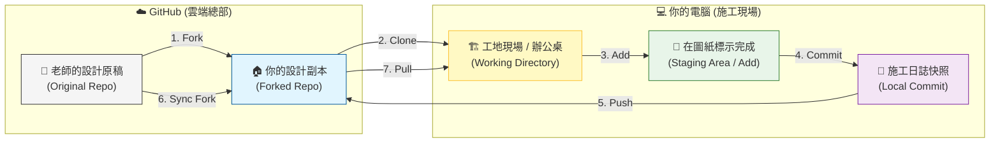

# 🚀 軟體開發入門：從 Vibe Code 到 Git 檔案管理

歡迎來到軟體開發的世界！這份指南是專為**完全不懂軟體、但想開始動手做**的初學者設計的。我們會用最直白的方式，告訴你這些看起來很專業的工具到底是做什麼用的、以及你該怎麼使用它們。

---

## 🏗️ 1. 核心工具大解密：誰是誰？

想像你在蓋一棟房子，你需要不同的工具與場地：

### 🖥️ VS Code + Antigravity (你的 AI 創作中心)
*   **角色**：你的**智慧工作台**。
*   **功能**：這是你寫程式、看成果的地方。**對於初學者來說，你可以將它們視為同一個東西**：VS Code 是你的畫布，而 Antigravity 是幫你拿畫筆的智慧助手。
*   **建議**：初學者只要選擇進入這個「創作環境」即可，不需要分開學習。你可以直接在裡面對著 AI 說出你的想法（這就是所謂的 **Vibe Code**）。
*   **💡 應用場景**：你想做一個「待辦清單」網頁。你只需要在 VS Code 打開一個新檔案，對 Antigravity 說：「幫我用 HTML/CSS 寫一個粉紅色主題的待辦清單」，它就會直接在你面前把程式碼「變」出來。

### 🐙 GitHub
*   **角色**：你的**雲端保險箱與展示櫃**。
*   **功能**：你寫好的東西會傳到這裡備份。別人也可以在這裡看到你的作品，它是全世界程式設計師的社交平台。
*   **💡 應用場景**：如果你電腦不小心噴到咖啡壞掉了，只要你有把程式碼「Push」到 GitHub，換台電腦登入後，所有的程式碼都能一秒找回來。

### 🌳 SourceTree
*   **角色**：你的**地圖與遙控器**。
*   **功能**：Git 本身像是一個隱藏在背景的黑盒子，SourceTree 是把裡面的資料畫成漂亮的「樹狀圖」。你可以清楚看到：「誰在兩天前改了什麼？」，這比輸入一行行的指令（Terminal）要直觀得多。
*   **💡 應用場景**：你昨晚寫得很順，但今天早上 AI 幫你改了一個功能後，整個網頁突然動不了了。你可以打開 SourceTree，找到昨天那個「正確的點」，按一下滑鼠就能讓時間倒流。

---

## 📊 2. 工具差異對照表

| 工具組合 | 類型 | 核心用途 | 什麼時候用它？ |
| :--- | :--- | :--- | :--- |
| **VS Code / Antigravity** | **AI 創作中心** | 撰寫程式、實現想法 | **想做東西時**。直接用說的（Vibe）請 AI 幫你寫出代碼。 |
| **GitHub** | **雲端保險箱** | 備份、分享程式碼 | **想存檔到雲端時**。確保電腦壞了東西還在。 |
| **SourceTree** | **時光機面板** | 視覺化管理檔案版本 | **想看紀錄時**。清楚看到「之前改了什麼」，不小心寫壞了也能一鍵還原。 |

---

## 🧭 3. Git 的建築設計學 (資訊流可視化)

如果你覺得 Git 指令很抽象，讓我們用**建築設計與工地管理**來類比。這張圖呈現了從「總部設計圖」到「你家施工現場」的完整流程：

*(若圖片無法顯示，請參考下方的流程圖)*

---

## 🏗️ 4. 建築師的 Git 術語對照表

| Git 指令 | 建築設計類比 | 什麼時候用？ |
| :--- | :--- | :--- |
| **Fork** | **影印副本** | 當你想把別人的設計圖「影印一份」到自己的書桌上時。 |
| **Clone** | **建立工地** | 將你書桌上的設計圖「帶到施工現場」，正式開始工作。 |
| **Status** | **檢查工地** | 查看目前的工具有沒有亂放、牆面有沒有變動。 |
| **Add** | **標註範圍** | 將今天已經做好的部分「在圖紙上面標好完成」，準備驗收。 |
| **Commit** | **拍照紀錄** | 對著圖裡的範圍到現場「拍一張快照」並寫下施工日誌。這是一個存檔點。 |
| **Push** | **回報總部** | 將你手中的施工日誌「上傳回雲端副本」，讓雲端也同步最新進度。 |
| **Sync Fork** | **總部同步** | 在 GitHub 網頁上按鈕，把老師（總部）的新設計圖更新到你的副本。 |
| **Pull** | **下載更新** | 每天開工前，從你的雲端副本下載最新的變更到電腦。 |

---

## ⚙️ 5. 它們如何協作？（資訊流導覽）

當你今天想做一個新功能，流程通常是這樣的：

1.  **開啟 VS Code**：打開你的專案檔案。
2.  **求助 Antigravity**：跟 AI 說：「幫我做一個航班追蹤器」。AI 會在 VS Code 幫你寫出程式碼。
3.  **確認成果**：你在電腦上看到功能跑起來了，感覺很棒（Good Vibe）。
4.  **打開 SourceTree**：你會看到 SourceTree 右上角出現紅色的數字，這代表「檔案有變動囉！」。
5.  **Commit (存檔點)**：就像在影片中提到的「模特兒拍快照」，你透過 SourceTree 幫這次的改動貼上一張小貼紙（Commit Message），寫著：「新增航班追蹤功能」。
6.  **Push (上傳)**：按下 SourceTree 頂部的 **「推送 (Push)」** 按鈕，把這個改動傳送到 **GitHub**。

---

## 🎨 6. 為什麼要用 SourceTree 而不是只用 VS Code？

雖然 VS Code 裡面也可以做基本的 Git 操作，但對初學者來說，分開工具的好處很多：

| 操作方式 | 適合對象 | 優點 | 缺點 |
| :--- | :--- | :--- | :--- |
| **Terminal (指令式)** | 專業開發者 | 速度極快、功能最全 | 門檻極高，錯一個字就報錯 |
| **VS Code (內建)** | 中階開發者 | 不用切視窗，方便 | 介面擁擠，看不清整體的「分支樹」 |
| **SourceTree (圖形化)** | **初學者 / 視覺派** | **一目了然的線條、直觀的存檔點** | 需要額外開一個視窗 |

**為什麼初學者首選 SourceTree？**
1.  **看見歷史**：它能把抽象的「版本」畫成樹狀圖，讓你看到代碼是怎麼分岔又怎麼合併的。
2.  **安全性**：在按下按鈕前，你可以清楚看到「我到底改了哪幾行」，避免不小心存了錯誤的代碼。

---

## 🤖 7. Antigravity 如何幫你處理 Git？

AI 不只能寫程式，它也是你的 Git 隨身教練：

*   **自動撰寫 Commit 訊息**：
    *   **怎麼做？**：你可以把改動的程式碼貼給 AI，問它：「幫我依照目前的變更寫一個專業的 Commit Message，要包含為何修改」。
    *   **為什麼要這樣？**：以後回頭看紀錄時，你會感謝 AI 幫你寫得很清楚。
*   **解讀衝突 (Conflict)**：
    *   **怎麼做？**：當 SourceTree 出現驚嘆號說「衝突」時，把那段程式碼丟給 AI：「有兩個人改了同一個地方，請幫我分析哪一個版本才是正確的，或者幫我合併它們」。
*   **操作指令翻譯**：你可以問 AI：「我想把目前的進度先存起來但不提交（Stash），在 SourceTree 該按哪裡？」

---

## 🛠️ 8. 事前準備：在開始之前你需要做什麼？

在進入實戰演練之前，你需要先完成以下準備工作。**這是最重要的步驟，請一步一步照做**：

### 步驟 A：安裝必要工具

你需要安裝以下三個免費工具（如果已經有了可以跳過）：

| 工具 | 下載連結 | 用途 |
| :--- | :--- | :--- |
| **VS Code** | [下載頁面](https://code.visualstudio.com/) | 編輯程式碼 |
| **SourceTree** | [下載頁面](https://www.sourcetreeapp.com/) | 管理 Git |
| **Git** | [下載頁面](https://git-scm.com/downloads) | Git 核心程式 |

> **💡 安裝提示**：下載後雙擊安裝檔，一路點「下一步」即可。SourceTree 安裝時會要求註冊 Atlassian 帳號（免費），請依指示完成。

### 步驟 B：取得練習教材

為了讓你擁有完整的權限來「推送 (Push)」代碼，我們不直接下載，而是先在 GitHub 建立你自己的副本。

**1. 首先執行：Fork（建立個人副本）**
*   打開瀏覽器，前往老師的倉庫：**https://github.com/shuotao/GIT_Learn**
*   在頁面右上方找到一個像叉子的圖示，上面寫著 **「Fork」**。
*   點擊它，然後選擇儲存在你的帳號下。
*   *💡 這就像是把老師的筆記「影印一份」放到你的個人書架上。這份影印本現在是你的，你想怎麼改都可以。*

**2. 接下來：取得「你自己的」網址**
*   Fork 完後，網頁會自動跳轉。請確認網址列現在是 `https://github.com/你的帳號名/GIT_Learn`。
*   點擊綠色的 **「<> Code」** 按鈕。
*   **複製** 裡面的 HTTPS 網址。

**3. 下載教材到電腦**
你有兩種方式（推薦方法二）：

*   **方法一：直接下載 ZIP**
    *   在綠色按鈕選單中選擇 **「Download ZIP」**。
    *   下載後解壓縮到桌面。
*   **方法二：使用 SourceTree Clone（強烈推薦）**
    *   打開 **SourceTree**，點選 **「Clone」**。
    *   **貼上剛剛從你自己帳號複製的網址**。
    *   選擇儲存路徑，按下 **「Clone」**。

> **🔍 為什要這麼麻煩？**
> 因為 Git 非常注重權限。如果你直接拿老師的網址，你只能「讀（Pull）」，不能「寫（Push）」。有了這份 Fork 過來的副本，你才算真正擁有了這座實驗場。

### 步驟 C：用 VS Code 開啟專案資料夾

1.  打開 **VS Code**
2.  點選左上角的 **「檔案 (File)」** → **「開啟資料夾 (Open Folder)」**
3.  選擇你剛剛解壓縮的 **`GIT_Learn-main`** 資料夾，按下「選擇」
4.  現在你的左側欄會顯示資料夾內的所有檔案

> **💡 如果你使用 Antigravity**：直接在 Antigravity 對話框輸入：「幫我打開桌面上的 GIT_Learn-main 資料夾」，它會自動幫你開啟。

### 步驟 D：用 SourceTree 開啟同一個專案

1.  打開 **SourceTree**
2.  將你的 **`GIT_Learn-main`** 資料夾**直接拖曳**到 SourceTree 視窗中
3.  它會自動識別這是一個 Git 專案並加入清單
4.  雙擊該專案即可進入

> **⚠️ 常見問題**：如果 SourceTree 說「這不是 Git 版本庫」，代表你下載的 ZIP 解壓後還沒被 Git 追蹤。請在 SourceTree 中點選 **「建立 (Create)」**，選擇該資料夾，初始化一個新的版本庫。

---

## 🚀 9. 實戰演練：你的第一次存檔 (First Commit)

現在你已經準備好了！讓我們來練習你人生中的第一次 Git 存檔：

### 第一步：在 VS Code 修改檔案
1.  在 VS Code 左側欄，找到並點擊 **`README.md`** 檔案
2.  檔案會在右側編輯區打開
3.  滾動到檔案**最下面**
4.  在最後一行按下 **Enter** 換行
5.  輸入：`這是我的第一次 Git 練習！`
6.  按下 **Ctrl+S**（Mac 是 **Cmd+S**）儲存

> **💡 使用 Antigravity 的做法**：你也可以對 AI 說：「幫我在 README.md 的最後面加上一行『這是我的第一次 Git 練習！』」，它會幫你完成。

### 第二步：切換到 SourceTree 查看變動
1.  打開 **SourceTree**（如果已經開著，點一下視窗讓它到前面）
2.  在左側導覽列點擊 **「檔案狀態 (File Status)」**
3.  你會在畫面下半部看到 **「未暫存檔案 (Unstaged Files)」** 區域
4.  `README.md` 應該會出現在這裡，旁邊有個**橘色圓點**（代表「已修改」）

### 第三步：Stage（讓檔案「站好位」）
1.  在 `README.md` 前方的 **方框打勾** ☑️
2.  檔案會自動跳到上面的 **「已暫存檔案 (Staged Files)」** 區域
3.  *💡 這個動作就像在攝影棚請模特兒站好位，準備拍照*

### 第四步：Commit（按下快門，建立存檔點）
1.  在畫面下方找到一個**空白的文字方塊**
2.  在裡面輸入：`實作第一次 Git 練習`
3.  點擊右下角的 **「提交 (Commit)」** 按鈕
4.  *💡 喀擦！你已經成功建立了一個存檔點！*

> **💡 讓 AI 幫你寫訊息**：你可以問 Antigravity：「幫我根據這次的修改寫一個專業的 Commit Message」，它會給你建議。

### 第五步：Push（把存檔上傳到雲端）
1.  點選 SourceTree 最上方工具列的 **「推送 (Push)」** 按鈕
2.  會跳出一個確認視窗，確認 `main` 分支有打勾
3.  按下 **「確定」** 或 **「Push」**
4.  等待幾秒鐘，直到進度條完成

🎉 **恭喜！你的第一次 Git 操作完成了！** 現在你可以去 GitHub 上重新整理頁面，就會看到你剛剛加的那行文字了！

---

## 📡 10. Pull：當「總部」有更新時該怎麼辦？

這是一個很重要的觀念：因為你現在是在自己的「工作室 (Fork)」工作，所以當「總部 (老師的 Repo)」有更新時，你的「工作室」是不會自動知道的。

你需要主動去「按一下」同步按鈕：

### 實戰練習：領取你的「學習手冊成功勳章」

為了讓你練習這個流程，我已經在「總部」新增了一個 `SUCCESS.md`。請照著以下步驟把它抓下來：

**第一階段：同步你的雲端工作室 (Sync Fork)**
1.  打開瀏覽器，回到你 GitHub 上的專案頁面（`https://github.com/你的帳號名/GIT_Learn`）。
2.  在頁面中間找一個寫著 **「Sync fork」** 的按鈕（通常在綠色 Code 按鈕的左邊）。
3.  點下去，選擇 **「Update branch」**。
4.  顯示 "Successfully fetched and fast-forwarded..." 代表你的雲端副本已經跟老師同步了！

**第二階段：拉取到你的電腦 (Pull)**
現在，你的雲端副本已經有了新檔案，接下來才是「Pull」：

1.  開啟 **SourceTree**。
2.  點擊上方的 **「拉取 (Pull)」** 按鈕。
3.  按 **「OK」**。
4.  等待跑完，回去看你的資料夾...
5.  **神奇的事情發生了！** `SUCCESS.md` 出現可以領取了！

> **💡 觀念修正**：
> `Pull` 預設只能從「你自己的雲端」抓資料。所以如果老師更新了，你必須先讓「你自己的雲端」跟老師同步 (Sync Fork)，然後再從自己的雲端 `Pull` 下來。

> **😱 常見焦慮：如果我也改了檔案，Pull 下來會不會爆炸？**
> 別擔心！想像這是一棟 **7 層樓的大樓**：
> *   **你的工作 (Clone/Fork)**：你把整棟大樓的圖紙拿來，但你負責施工的範圍是 **1 樓的接待大廳**。
> *   **老師的更新 (Pull)**：老師（總部）發布了 **3 樓到 7 樓** 的結構補強圖紙。
> *   **結果**：當你 Pull 下來時，Git 會自動把 3-7 樓的圖紙換新，而你正在施工的 1 樓完全不會受影響。你的 Commit 是在告訴總部：「我把 1 樓做好了」，這跟總部改 3 樓是不衝突的。
>
> 只有當「兩個人同時都要改 1 樓大廳的同一個櫃檯」時，才會發生**衝突 (Conflict)**。這時候可以請 Antigravity 幫忙協調。
> *(註：如果不幸遇到更複雜的「多人改結構」災難，那需要更進階的 Branch 分流技巧，這部分我們會在 12/26 的實戰課深入討論。)*

## 💊 11. 初學者的「後悔藥」：做錯了怎麼辦？

在學 Git 的路上，你一定會遇到「啊，我不小心改壞了」的時候。別擔心，SourceTree 就是你的時光機面板：

*   **還沒存檔 (Commit) 前就想反悔**：
    *   **場景**：你改了半天發現方向錯了，想回到這份檔案最原始的樣子。
    *   **做法**：在 SourceTree 對著該檔案點右鍵，選擇 **「捨棄 (Discard)」**。這會像橡皮擦一樣把你的改動抹掉。
*   **剛按下存檔 (Commit) 但發現打錯字**：
    *   **場景**：Commit 訊息寫錯了，或者少勾了一個檔案。
    *   **做法**：勾選下方的 **「修改最後一次提交 (Amend last commit)」**，這能讓你把新的東西塞進上一個存檔點裡。
*   **想回到很久以前的某個版本**：
    *   **場景**：昨天的版本比較好，今天的都被我改爛了。
    *   **做法**：在 SourceTree 的歷史紀錄中找到那個點，點右鍵選擇 **「重置 (Reset)」**。初學者建議選擇 **「Hard (硬性重置)」**（**注意：這會清掉你目前所有還沒存檔的東西，請謹慎使用！**）。

---

## 📚 12. 學習資源推薦

*   **推薦好書**：**《為你自己學 Git》** (高見龍著) - 這是一本非常親民的入門書。我們沒有內附這本書，但**強烈建議你去買一本實體書或找電子版來讀**，特別是從「第四章：Git 的基本操作」開始看起，會讓你的功力大增。
*   **影音導引**：[YouTube 基礎教學](https://www.youtube.com/watch?v=FKXRiAiQFiY) - 配合著本指南一起看，你會對「遠端倉庫 (Repo)」更有概念。
*   **實戰直播**：**[12/26 Vibe Code 進階實戰班](https://forms.gle/QKUfDjAHAg3nA1VA8)** - 如果你想看我們現場演示如何「10分鐘寫完一天程式碼」以及「大型團隊 Git 協作密技」，歡迎報名。

---

## 💡 13. 給初學者的 Vibe Code 心法

1.  **先求 Vibe (感覺)，再求懂**：不需要一開始就把 Git 指令背起來。先讓 Antigravity 幫你做出東西。
2.  **小步存檔 (Commit)**：每次 AI 幫你做完一個小功能，就去 SourceTree 按下「Commit」。這就像玩遊戲過關後的存檔，萬一下一秒 AI 把程式寫爛了，你隨時可以「讀檔」回到最棒的時刻。
3.  **看圖識字**：Git 的概念比較抽象，強烈建議搭配《為你自己學 Git》這本書一起看。看書裡的圖解，再對照 SourceTree 裡的線條，你會發現 Git 其實就是一棵會長大的樹。
